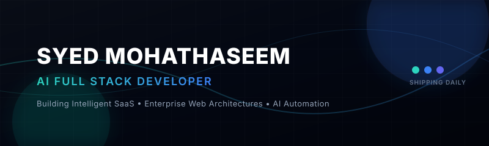

<!-- Premium GitHub Profile Layout by Antigravity -->

  <!-- Custom Neon Dark Banner -->
  

    

  <!-- Interactive Typing Sub-headline -->
  

  

    <strong>Building the next generation of AI-powered web applications and SaaS products.</strong>
  

  <!-- High-end Minimal Social Pills -->
  

    
    
    
  

### 🚀 About Me

I am a forward-thinking **AI Full Stack Developer** dedicated to building intelligent, user-centric web applications and SaaS products. Currently in my third year of Computer Science, I bridge the gap between sophisticated AI models (LLMs, workflows) and production-ready architectures. 

- 💻 **Core Focus:** Creating highly performant web applications using HTML5, React, and Node.js.
- 🤖 **AI Specialty:** Integrating OpenAI and Gemini APIs, designing automated AI agents, and leveraging Vibe Coding techniques to build products rapidly.
- ⚡ **Philosophy:** Writing clean, scalable code that translates complex business requirements into elegant software solutions.
- 🌍 **Open for:** Remote roles, software engineering internships, and high-impact freelance projects.

---

### 🛠️ Tech Stack & Capabilities

<table width="100%">
  <tr>
    <td width="50%" valign="top">
      <h4>💻 Frontend Engineering</h4>
      
      
      
      
      
    </td>
    <td width="50%" valign="top">
      <h4>⚙️ Backend & Database</h4>
      
      
      
      
    </td>
  </tr>
  <tr>
    <td width="50%" valign="top">
      <h4>🤖 Artificial Intelligence</h4>
      
      
      
      
      
    </td>
    <td width="50%" valign="top">
      <h4>📦 DevOps & Tooling</h4>
      
      
      
      
    </td>
  </tr>
</table>

---

### 📂 Featured SaaS & AI Applications

<table width="100%">
  <tr>
    <td width="50%" valign="top">
      <h3>☕ Cafe Rehans</h3>
      
<strong>AI-Powered Modern Cafe Platform</strong>

      
A performant customer experience system designed with custom AI ordering agents, responsive UI layouts, and lightning-fast page loading.

      

        <a href="https://caferehans.netlify.app" target="_blank">🚀 Live Website</a> &nbsp;|&nbsp; 
        <a href="https://github.com/SyedMohathaseem/CafeRehans">💻 Code Repository</a>
      

      

        
        
        
      

    </td>
    <td width="50%" valign="top">
      <h3>💼 Professional Portfolio</h3>
      
<strong>Modern Responsive Engineer Showcase</strong>

      
A premium developer workspace detailing production projects, interactive live previews, micro-animations, and high-fidelity styling.

      

        <a href="https://syedmohathaseem.tech" target="_blank">🚀 Live Website</a> &nbsp;|&nbsp; 
        <a href="https://github.com/SyedMohathaseem/portfolio">💻 Code Repository</a>
      

      

        
        
        
      

    </td>
  </tr>
  <tr>
    <td width="50%" valign="top">
      <h3>🤖 AI Full Stack Workflows</h3>
      
<strong>Intelligent SaaS Integrations</strong>

      
A library of modular engines utilizing Gemini and OpenAI APIs to handle prompt chaining, voice assistant transcripts, and document embedding.

      

        <a href="https://github.com/SyedMohathaseem/ai-workflows">💻 Code Repository</a>
      

      

        
        
        
      

    </td>
    <td width="50%" valign="top">
      <h3>⚡ Enterprise & SaaS Boilerplates</h3>
      
<strong>Database & Auth Systems</strong>

      
Ready-to-deploy SaaS frameworks featuring Express.js APIs, Firebase user authentication rules, and optimized MySQL databases.

      

        <a href="https://github.com/SyedMohathaseem/saas-boilerplate">💻 Code Repository</a>
      

      

        
        
        
      

    </td>
  </tr>
</table>

---

### 📊 Code Metrics & Active Shipping

  <table width="100%">
    <tr>
      <td width="50%" align="center">
        
      </td>
      <td width="50%" align="center">
        
      </td>
    </tr>
  </table>

---

### 🤝 Let's Design the Future

I'm highly adaptive, comfortable with fast-paced environments, and always looking to build next-generation tech. Let's discuss internships, freelance contracts, or technical collaborations!

  
  &nbsp;&nbsp;
  

 

  Designed with precision &bull; Syed Mohathaseem &copy; 2026

